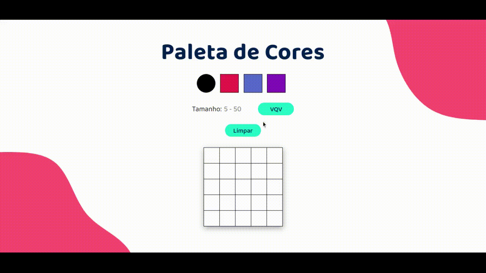

# Pixel Art - Project

  

 

### This was the first project I developed during [Trybe's](https://www.betrybe.com/) Bootcamp with JavaScript, HTML and CSS.
 

### Skills that were evaluanted:
* Manipulating the DOM
* Manipulating Javascript
 

### The requirements
* Implement a pixel art editor.
  * Given a color palette and a pixels frame, you will allow whoever uses it to be able to paint whatever they want on the frame.